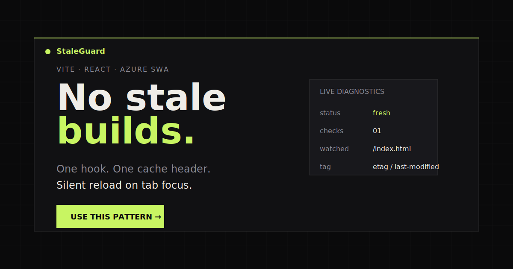

# StaleGuard

This repo is a small Vite + React + TypeScript project that demonstrates silent deployment refreshes for stale tabs.



It is designed to work in two roles:

- a testing ground for validating the focus-triggered version check pattern
- a polished static site that can be published as an article on GitHub Pages

## Core idea

Vite already fingerprints JavaScript and CSS bundles, so the stale deployment problem is really about `index.html`.

Every new build rewrites the hashed bundle references inside `index.html`, which changes the file content. On Azure Static Web Apps, that naturally produces a new `ETag`. The app stores the original tag on first load and checks it again whenever the tab regains focus.

If the tag changed, the app reloads immediately and silently.

## Why the name

StaleGuard describes the goal directly: it guards users from silently continuing on a stale deployed build.

## Repo contents

- `src/hooks/useVersionCheck.ts`: production-oriented hook with `ETag` then `Last-Modified` fallback
- `public/staticwebapp.config.json`: Azure Static Web Apps cache rule for `index.html`
- `src/App.tsx`: article-style page plus a live diagnostics panel
- `public/og-image.svg`: social preview/share image
- `public/404.html`: fallback page for static hosting
- `.github/workflows/deploy-pages.yml`: GitHub Pages deployment workflow

## Local development

```bash
npm install
npm run dev
```

For a more realistic static-host check:

```bash
npm run build
npm run preview
```

## Test this locally

1. Start the app with `npm run preview`.
2. Open the preview URL in a browser tab.
3. Confirm the diagnostics panel captures a baseline tag on first load.
4. Make a visible change to the app, for example edit the hero copy in `src/App.tsx`.
5. Run `npm run build` again.
6. Refresh the preview server if needed, switch away from the tab, then focus the tab again.
7. Confirm the page silently reloads when the tag changed.

For offline behavior:

1. Open the page once while connected.
2. Disable network in devtools or disconnect your machine.
3. Focus the tab again.
4. Confirm the UI stays stable and only reports an offline state.

## Azure Static Web Apps behavior

The hook sends:

```ts
fetch(indexHtmlUrl, {
  method: "HEAD",
  cache: "no-store",
});
```

The Azure config sets:

```json
{
  "route": "/index.html",
  "headers": {
    "Cache-Control": "no-cache, no-store, must-revalidate"
  }
}
```

That combination makes sure the browser asks for fresh headers on each focus check.

## GitHub Pages publishing

This repo includes a GitHub Actions workflow that builds the app and deploys `dist/` to GitHub Pages on every push to `main`.

To enable it:

1. Push this repo to GitHub.
2. Open repository settings.
3. Under Pages, set the source to GitHub Actions.
4. Push to `main` or run the workflow manually.

The Vite config uses `base: "./"` so the built site can be served from a project subpath without rewriting asset URLs.

## Hosting behavior

### Azure Static Web Apps

- Best fit for this pattern because `ETag` is typically present on `index.html`.
- `public/staticwebapp.config.json` forces `Cache-Control: no-cache, no-store, must-revalidate` for `index.html`.
- In practice the hook usually compares `ETag` first and falls back to `Last-Modified` only when needed.

### GitHub Pages

- Good for sharing the article and demo publicly.
- `Last-Modified` fallback is more likely to be the header used here.
- The included `404.html` gives the project a branded fallback page for static hosting.

## Deploy URLs

- Expected GitHub Pages URL: `https://trivedi-vatsal.github.io/StaleGuard/`
- Azure Static Web Apps URL: add your generated production URL here after deployment

## Testing checklist

1. Deploy one build and open the app.
2. Deploy a changed build.
3. Switch to another tab.
4. Focus the app again.
5. Confirm it reloads and picks up the new bundles.

Also verify:

- offline focus does not crash the app
- multiple tabs refresh independently
- missing `ETag` still works when `Last-Modified` is present
- GitHub Pages still behaves correctly when only `Last-Modified` is available
- mobile layout stays readable around 768px and 560px breakpoints

## Notes

- The live diagnostics panel is intentionally visible in this POC so behavior is easy to verify.
- In a production app, you can keep the hook exactly as-is and remove the visible diagnostics UI.
- Optional analytics were intentionally left out so the demo stays dependency-free and privacy-light.
